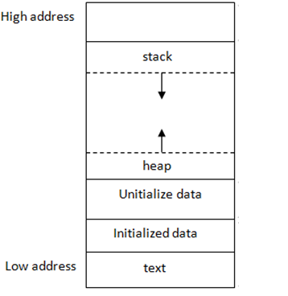

# Dynamic Memory Allocation

Dynamic memory allocation is generally used if we don't know in advance how much memory our program will be using.

Dynamically allocated memory comes from a part of memory known as **Heap**.

As an aside, local function variables come from the **Stack**, while static and global variables live in dedicated **Data/BSS segments**.

In general heap and stack addresses grow toward each other.



So for instance, addresses from stack start at `0xFFFF` and *grow* towards `0x0000` 

Conversly, addresses from heap start at `0x0000` and grow towards `0xFFFF`.

### How to allocate memory dynamically in C?

For that we use `malloc()`. Where we pass as argument the number of bytes requested. After obtaining memory for you, `malloc()` will return a pointer to that memory.

In case where `malloc()` can't give memory it'll hand back a `NULL`

Consider this program:
```c
#include <stdio.h>
#include <stdlib.h>

int main(void)
{
    int a; // statically allocated
    int b;
    int *p1 = &a; // address of a
    int *p2 = &b; // address of b 

    int *pa = malloc(sizeof(int)); // dynamically allocated 
    int *pb = malloc(sizeof(int)); // dynamically allocated 
    
    printf("Statically allocated addresses: \n");
    printf("%p\n", p1);
    printf("%p\n", p2);

    printf("\n"); // new line

    printf("Dynamically allocated addresses:\n");
    printf("%p\n", pa);
    printf("%p\n", pb);

}

```
The result is as follows:
```
Statically allocated addresses: 
0x7fffe96f9950
0x7fffe96f9954

Dynamically allocated addresses:
0x5eab21d87010
0x5eab21d87030
```

The question pops up. Why the second dynamically allocated memory address is `0x5eab21d87030`?! Shoudln't it be `0x5eab21d87014`???

In reality heap allocators like malloc need to know 3 things:
- How large the block is
- Whether the adjacent block is free or in use
- Links to other free memory blocks

These informations are stored in *headers*. Headers are usually 8 to 16 bytes long on 64-bit systems. 

On standard 64-bit C libraries guarantees that every returned pointer is aligned to a 16-byte boundary.
This means every heap allocation size gets rounded up to the nearest multiple of 16 bytes.

So tracking back our example:
```
Header metadata = 16 bytes
Requested memory for int = 4 bytes
Padding for alignment = 12 bytes (to reach next multiple of 16 bytes)

Total size per chunk  = 16 + 4 + 12 = 32 bytes (0x20 in hex)
```

Remember to **always** return memory back using `free()`

### Example of freeing memory

```C
// dynamically allocated a 50 character long array  
char *word = malloc(50 * sizeof(char));

// do stuff with word

// now we're done working with that block

free(word);
```

**Three golden rules of dynamic memory allocation**
1. Every block of memory that you `malloc()` must be subsequently `free()`
2. Only memory that you `malloc()` should be `free()`
3. DO NOT `free()` a block of memory more than once.


